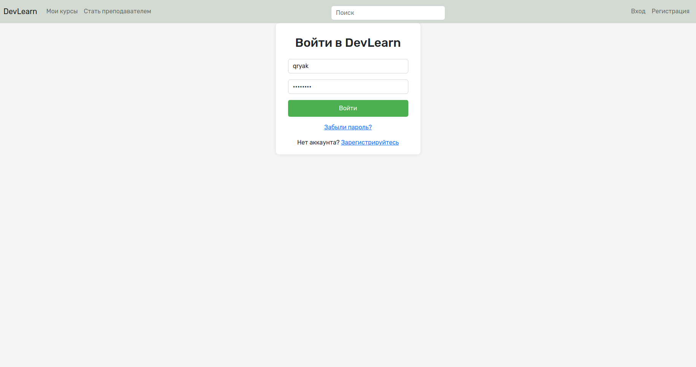
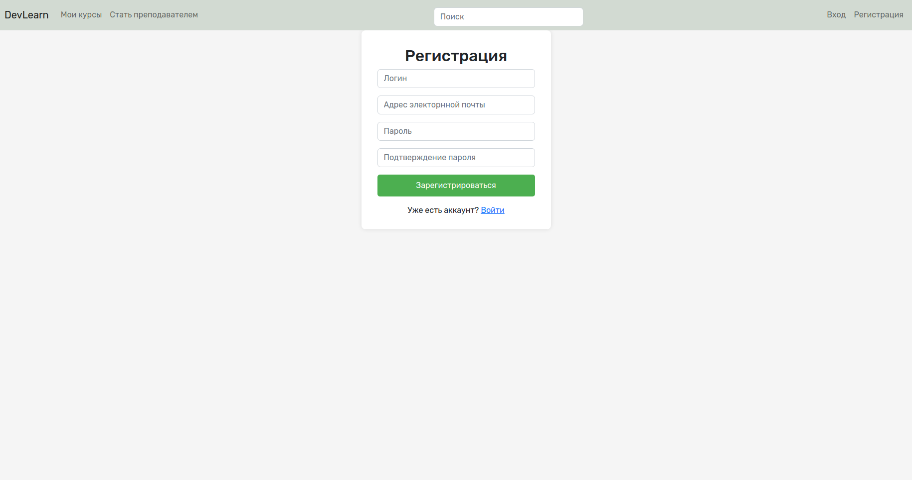
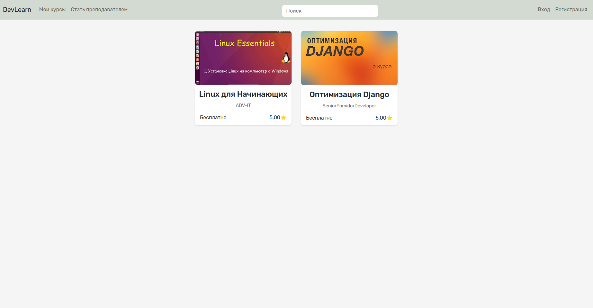
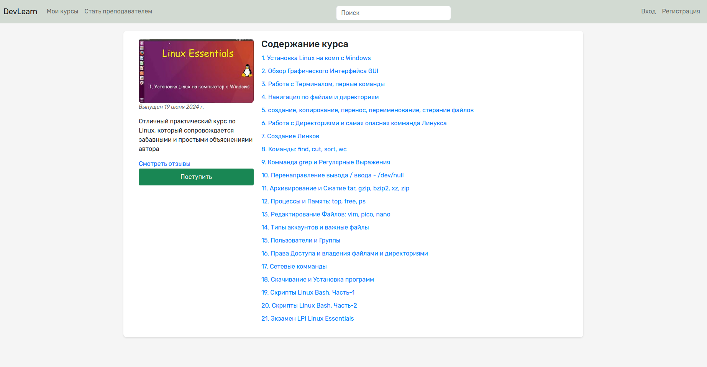
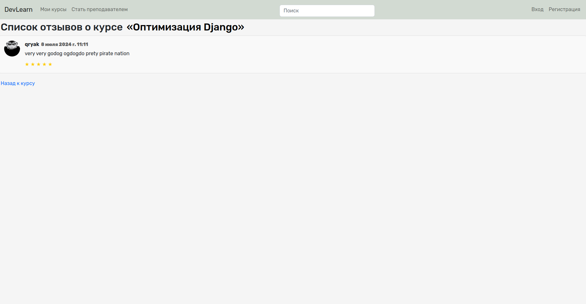
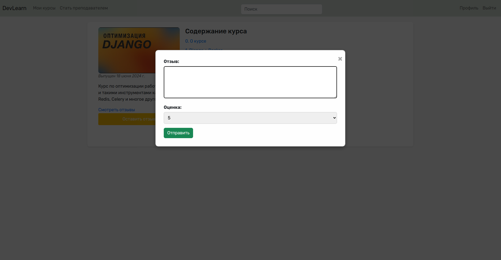
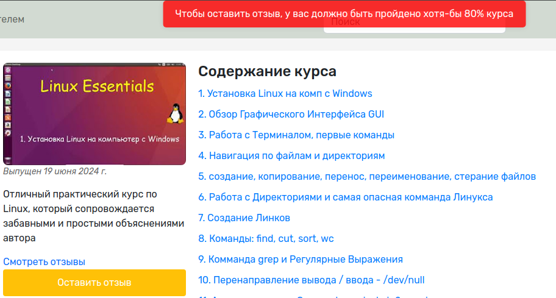
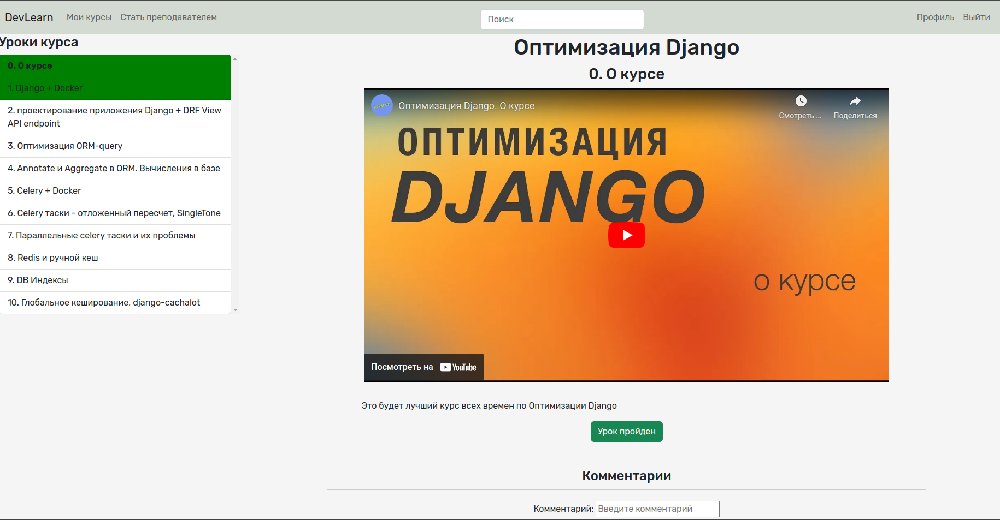
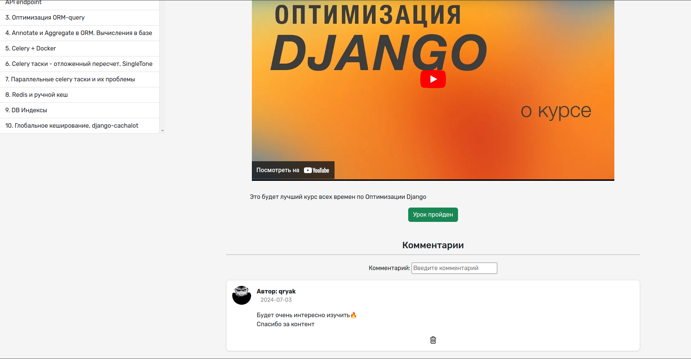
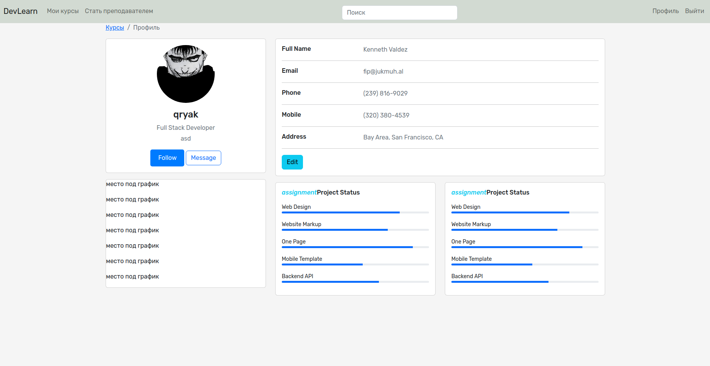

## О проекте
**[DevLearn]** Обучающая платформа на `Django`, в которой есть:
- [Авторизация](#img1)
- [Профили у каждого пользователя](#img10)
- Проходить курс можно только авторизовавшись
- [Возможность поступить на курс](#img4)
- [У каждого курса список уроков](#img4)
- [Возможность смотреть уроки курса (Youtube API)](#img8)
- [У каждого урока кнопка "Урок пройден"](#img8)
- [Отслеживание процента прохождения курса](#img7)
- [Отзывы у курсов, которые можно оставлять после прохождения 80% его уроков](#img6)

## Доработки (TODO)
1. Улучшение профиля пользователя, взаимодействие с ним
2. Возможность стать преподавателем и добавлять курсы
3. Деплой на Nginx & Gunicorn

## Запустить проект
- `docker-compose up --build`

## Технологии, использованные в проекте
1. Backend на `Django`
2. Frontend на `JavaScript` & `HTML` & `CSS`
3. REST API на `Django Rest Framework`
4. База Данных `PostgreSQL` 
5. Система кеширования и брокер сообщений `Redis`
6. Очереди задач `Celery` & `Flower`
7. Контейнеризация `Docker`
8. Бизнес-логика в модуле `services`, а не во `views`

## Изображения функционала:

